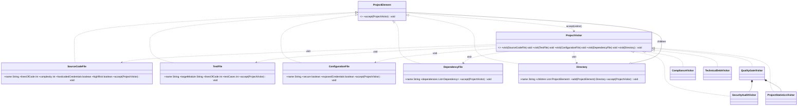

# Class diagram

```mermaid
classDiagram
    class ProjectElement { <<interface>> +accept(ProjectVisitor) void }
    class ProjectVisitor { <<interface>> +visit(SourceCodeFile) void +visit(TestFile) void +visit(ConfigurationFile) void +visit(DependencyFile) void +visit(Directory) void }
    class SourceCodeFile { +name String +linesOfCode int +complexity int +hardcodedCredentials boolean +highRisk boolean +accept(ProjectVisitor) void }
    class TestFile { +name String +targetModule String +linesOfCode int +testCases int +accept(ProjectVisitor) void }
    class ConfigurationFile { +name String +secure boolean +exposedCredentials boolean +accept(ProjectVisitor) void }
    class DependencyFile { +name String +dependencies List~Dependency~ +accept(ProjectVisitor) void }
    class Directory { +name String +children List~ProjectElement~ +add(ProjectElement) Directory +accept(ProjectVisitor) void }
    class SecurityAuditVisitor
    class ProjectStatisticsVisitor
    class QualityGateVisitor
    class ComplianceVisitor
    class TechnicalDebtVisitor
    ProjectElement <|.. SourceCodeFile
    ProjectElement <|.. TestFile
    ProjectElement <|.. ConfigurationFile
    ProjectElement <|.. DependencyFile
    ProjectElement <|.. Directory
    ProjectVisitor <|.. SecurityAuditVisitor
    ProjectVisitor <|.. ProjectStatisticsVisitor
    ProjectVisitor <|.. QualityGateVisitor
    ProjectVisitor <|.. ComplianceVisitor
    ProjectVisitor <|.. TechnicalDebtVisitor
    Directory o-- ProjectElement : children
    ProjectElement ..> ProjectVisitor : accept(visitor)
    ProjectVisitor ..> SourceCodeFile : visit
    ProjectVisitor ..> TestFile : visit
    ProjectVisitor ..> ConfigurationFile : visit
    ProjectVisitor ..> DependencyFile : visit
    ProjectVisitor ..> Directory : visit
    QualityGateVisitor *-- SecurityAuditVisitor
    QualityGateVisitor *-- ProjectStatisticsVisitor
```
