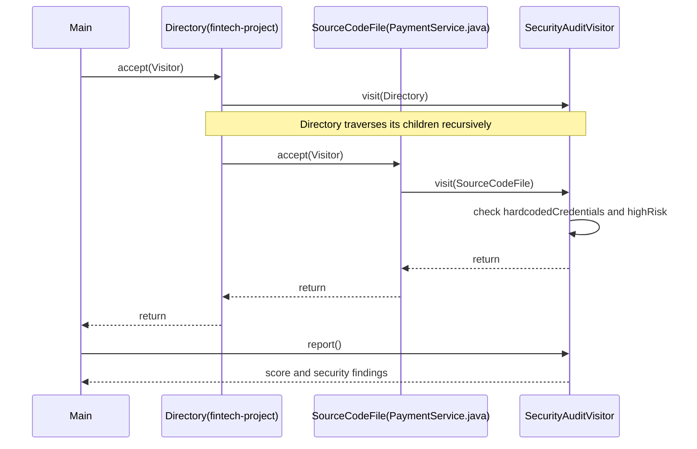

# Sequence diagram

```mermaid
sequenceDiagram
    participant Main
    participant Root as Directory(fintech-project)
    participant Child as SourceCodeFile(PaymentService.java)
    participant Visitor as SecurityAuditVisitor
    Main->>Root: accept(Visitor)
    Root->>Visitor: visit(Directory)
    Note over Root,Visitor: Directory traverses its children recursively
    Root->>Child: accept(Visitor)
    Child->>Visitor: visit(SourceCodeFile)
    Visitor->>Visitor: check hardcodedCredentials and highRisk
    Visitor-->>Child: return
    Child-->>Root: return
    Root-->>Main: return
    Main->>Visitor: report()
    Visitor-->>Main: score and security findings
```
